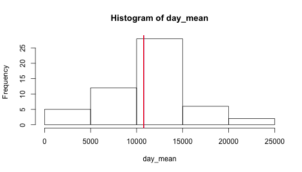
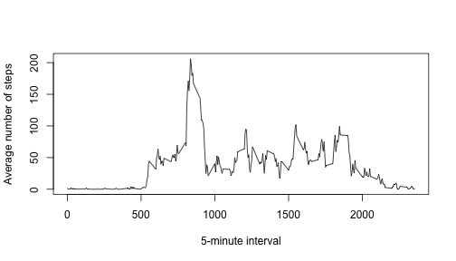
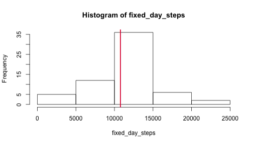
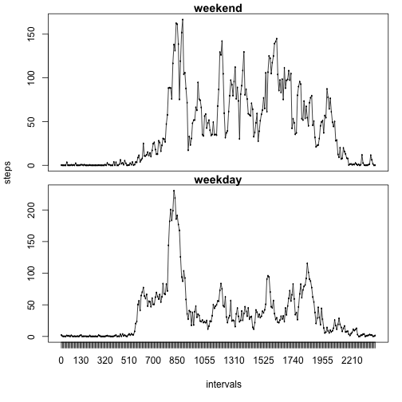

## Loading and preprocessing the data
We start with setting the working directory and some initialisation.

```r
zipfile = "./activity.zip"
file = "./activity.csv"
setwd("/Users/inesv/Coursera/5-Replicable/w2/RepData_PeerAssessment1")
```
We'll unzip if needed the activity file:

```r
if(!file.exists("file")) {
    unzip (zipfile, exdir = "./", junkpaths = TRUE)
    }
```
Then we load the activity file:

```r
data <-read.csv(file, header = TRUE, sep = ",", quote = "\"")
```

## What is mean total number of steps taken per day?
We start by calculating the number of steps per day. For that we use 'tapply' 
considering the date as a factor

```r
day_mean <- tapply(data$steps, data$date, sum)
day_mean_avg <- mean(day_mean, na.rm = TRUE)
day_mean_mdn <- median(day_mean, na.rm = TRUE)
hist(day_mean)
abline(v = day_mean_avg, col = "blue", lwd = 2)
abline(v = day_mean_mdn, col = "red", lwd = 2)
```

 

Mean and median are so close (10766.19 and 10765.00, respectively) that they overlap in the plot above.  

## What is the average daily activity pattern?
We calculate the average number of steps taken per 5-minute interval (x-axis), 
averaged across all days (y-axis).  
Again, we use 'tapply' using the column 'interval' as a factor.

```r
# convert interval to a factor
data$interval <- factor(data$interval)
str(data)
```

```
## 'data.frame':	17568 obs. of  3 variables:
##  $ steps   : int  NA NA NA NA NA NA NA NA NA NA ...
##  $ date    : Factor w/ 61 levels "2012-10-01","2012-10-02",..: 1 1 1 1 1 1 1 1 1 1 ...
##  $ interval: Factor w/ 288 levels "0","5","10","15",..: 1 2 3 4 5 6 7 8 9 10 ...
```

```r
# obtain the average per interval accross all days
interval_mean <- tapply(data$steps, data$interval, function(x){mean(x, na.rm = TRUE)})
plot(dimnames(interval_mean)[[1]], interval_mean, type ="l", xlab = "5-minute interval",
     ylab = "Average number of steps")
```

 


The interval with the highest average is 835 with 206.17 steps.

## Imputing missing values
As missing the presence of missing values may introduce bias, let's review how
many of them are there in our dataset.

```r
# count missing values
na_index <- is.na(data$steps)
num_na <- sum(na_index)
```

```r
# replace with mean value for the interval accross days

fixed_data <- data
fixed_data$steps[na_index] <- interval_mean[fixed_data$interval[na_index]]
```

Let's create a histogram to check how removing NA's has affected the dataset.


```r
fixed_day_mean <- tapply(fixed_data$steps, fixed_data$date, sum)
fixed_day_mean_avg <- mean(fixed_day_mean, na.rm = TRUE)
fixed_day_mean_mdn <- median(fixed_day_mean, na.rm = TRUE)
hist(fixed_day_mean)
abline(v = fixed_day_mean_avg, col = "blue", lwd = 2)
abline(v = fixed_day_mean_mdn, col = "red", lwd = 2)
```

 

The mean has not moved and is 10766.19 and the median has moved from 10765.00 to 10766.19. Mean and median are so close that they overlap in the plot above.

## Are there differences in activity patterns between weekdays and weekends?
Let's review how activity changes over the week.

```r
weekend_days <- c("Saturday", "Sunday")
fixed_data$weekend <- factor(weekdays(as.Date(fixed_data$date)) %in% weekend_days,
                             levels = c(TRUE, FALSE), 
                             labels = c("weekend","weekdays"))

steps <- aggregate(steps ~ weekend+interval, data = fixed_data, mean)
library(ggplot2)
w_end <- steps[steps$weekend == "weekend", ]
w_days <- steps[steps$weekend == "weekdays", ]
p <- par(mfrow = c(2, 1), 
    mar = c(0, 0, 1, 1) + 0.1, 
    oma = c(5, 4, 0, 0) + 0.1)

# plot 1, weekend
plot(x = w_end$interval, y = w_end$steps, type = "n", xaxt='n')
lines (x = w_end$interval, y = w_end$steps)
title(main="weekend")

# plot 2, weekdays
plot(x = w_days$interval, y = w_days$steps, type = "n")
lines(x = w_days$interval, y = w_days$steps)
title(main ="weekday")

# axis are common
title(xlab = "intervals",
      ylab = "steps",
      outer = TRUE, line = 3)
```

 
